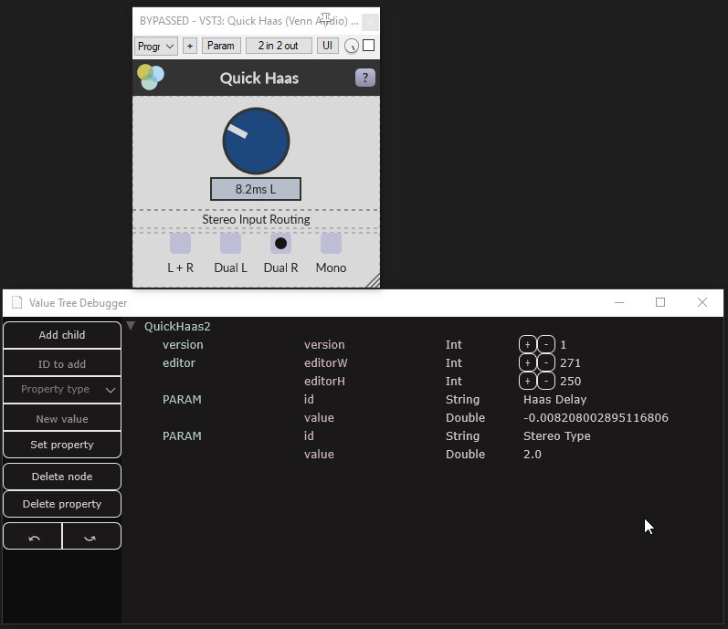
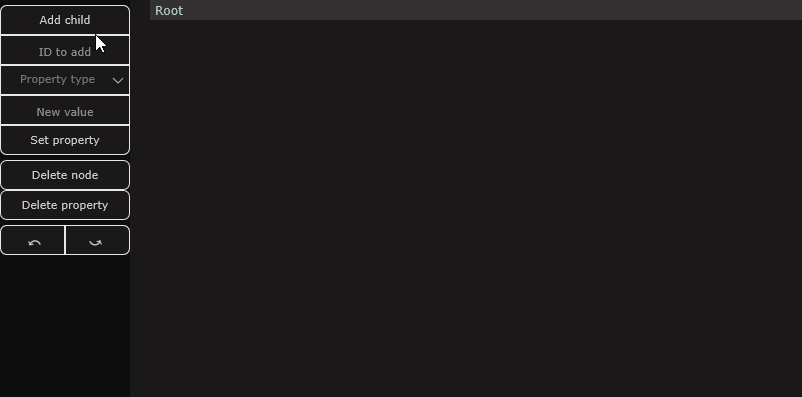

# Juce Value Tree Debugger
A window for viewing and modifying JUCE Value Trees while developing.

This project is adapted from https://github.com/jcredland/juce-toys. Many thanks to Jim for that repo.

## Get it

### Cmake

 - FetchContent the repo
 - `target_link_libraries(target PRIVATE vtdbg::vt_debugger)`

 or

 - Clone the repo
 - `add_subdirectory()`
 - `target_link_libraries(target PRIVATE vtdbg::vt_debugger)`

 ### Projucer
 - Clone the repo
 - Add module `Juce-Value-Tree-Debugger/value_tree_debugger`

## Use it

`#include <value_tree_debugger/value_tree_debugger.h>`

and make a

`vtdbg::ValueTreeDebugger vtDebugger{ state, &undoManager };`

If you pass in an Undo Manager it will be used for the Value Tree operations. If you don't want that, pass in `nullptr` instead.

## But what is it?

It's a window which allows you to view a Value Tree and its properties. You can:
 - Add child trees
 - Delete child trees
 - Add properties
 - Modify properties
 - Remove properties
 - Move node to become children of other nodes
 - Undo
 - Redo

## Like this

### Viewing updates

  

### Modifying state

  
